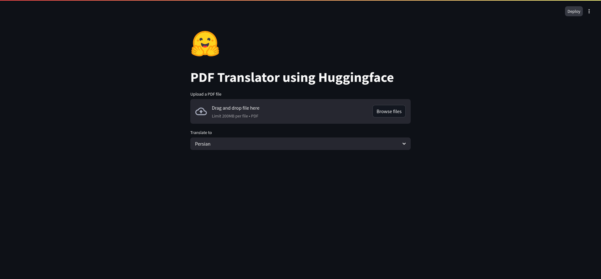

# DeepLingua - PDF Translator using Huggingface

A simple web-based app built with **Streamlit** to translate PDF files into multiple languages using the powerful **Huggingface** model.

# Features

- Upload any PDF file
- Translate full text into multiple languages (Persian, French, Spanish, etc.)
- Download the translated text

# Installation

### 1.Clone the repo:

```bash
git clone https://github.com/Rayiumir/DeepLingua.git
cd DeepLingua
```

### 2.Create a virtual environment (optional but recommended):

```bash
python -m venv venv
source venv/bin/activate  # On Windows: venv\Scripts\activate
```

### 3.Install dependencies:

```bash
pip install streamlit PyPDF2 huggingface_hub
```

### 4.and Run:

```bash
streamlit run main.py
```
Then open `http://localhost:8501` in your browser.

# Demo

<div align="center">
    <a href="https://github.com/Rayiumir/DeepLingua" target="_blank">
        
    </a>
</div>


